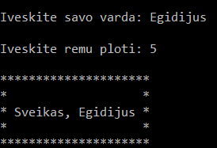

# Tekstas su rėmais

**Veikimas:**
  Ši programa sukuria rėmą iš "*" simbolio, kuris apgaubia vartotojo įrašytą vardą ir sveikinimą ("Sveikas/Sveika").;
  Rėmo plotį galima nustatyti pačiam (mažiausias plotis yra 3 eilutės);
  
  
  
 **CHANGELOG**
 - V0.1: Sudaromas rėmas aplink tekstą: 1 eilutė - remų viršus, 2 eilutė - rėmų šonai, 3 eilutė - rėmų šonai ir sveikinimas, 4 ir 5 eilutė tokios pačios kaip ir 2 ir 1 tik žemiau.
 - V0.2: Sveikinimas reaguoja į vardo giminę, t.y, vyriškus vardus sveikins su "Sveikas, ", o moteriškus su "Sveika, ".
 - V1.0: Visas kodas sukeltas į vieną kintamajį ir tai padaro labai lengva rėmų šabloną. Taip pat leidžiama nustatyti norimą rėmo plotį ir sveikinimą centruoja.
 
 **Naudojimas (WINDOWS)**
 - Jei neturite, atsisiųskite GNU kompiliatoriu ( https://sourceforge.net/projects/mingw/files/OldFiles/ ) ir susetupinkite.
 - Atsidarę CMD projekto aplankale įveskite:
  `g++ -o main main.cpp`
  `main.exe`
